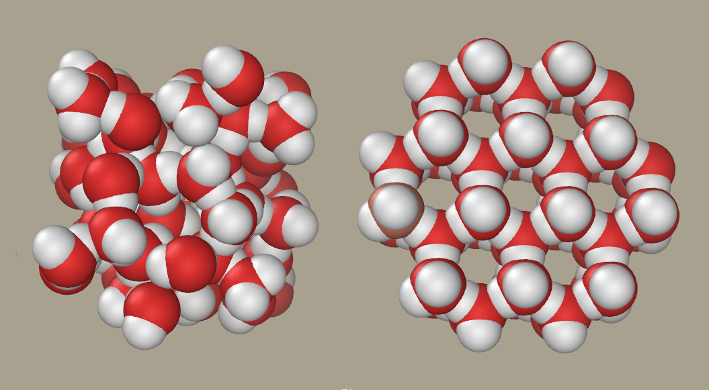
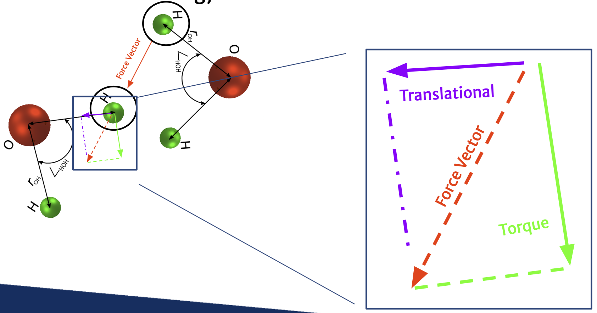
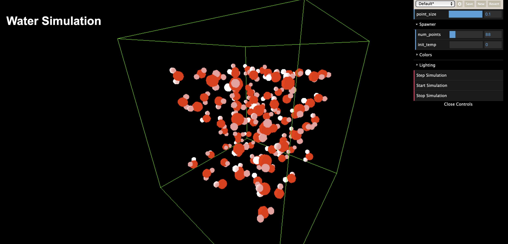
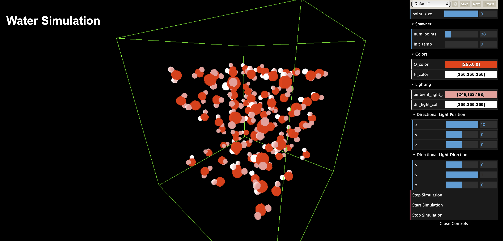

# CHEM279_Final_Project

Repository that we will use for our final project for CHEM279

## Build code

1. Run the [build image shell](./build_image.sh)
2. Run the [interactive shell](./interactive.sh)
3. Once in the docker, use ```npm start``` and ctrl + click the printed port in your cmd.

## The Idea

The main premise of this repository and project was to attempt to simultate liquid water slowly turning into solid ice in hopes to be able to show how the chaotic movements eventually combine into the more uniform structure that H2O is known to make up:



While we were able to get quite a lot done with this project, there is still much to be improved upon. For example, the coulombic force calculations (more on this later) is not quite there just yet. The molecules can rotate, but something seems to be buggy with the current implementation and math causing it to not quite be correct.

### The Math

In order to determine the forces that need to be calculated on a per molecule basis, we first need to consider a few common tactis for many water simulations. The first of which being that when it comes to and kind of repulsion or attraction energy, the Oxygen can largely be taken to be considered the largest impact to the movement of the molecules as it's mass size is quite large when compared to the hydrogen. With this in mind, we can focus our efforts on a very basic energy calculations widely used for the energy and force calculations of water particles. The Lennord-Jones potential energy and force:

$$U_{\text{LJ}}(r_{\text{OO}}) = 4 \varepsilon_{\text{SPC}} \left[ \left( \frac{\sigma_{\text{SPC/E}}}{r_{\text{OO}}} \right)^{12} - \left( \frac{\sigma_{\text{SPC/E}}}{r_{\text{OO}}} \right)^6 \right]$$

$$F_{\text{LJ}}(r_{\text{OO}}) = 24 \varepsilon_{\text{SPC}} \left[ 2.0\left( \frac{\sigma_{\text{SPC/E}}}{r_{\text{OO}}} \right)^{13} - \left( \frac{\sigma_{\text{SPC/E}}}{r_{\text{OO}}} \right)^7 \right]$$

After we have these forces, we apply them directly to the oxygens in the system, and allow the hydrogens follow as a byproduct of the hydrogen's positional tracking. To decide where the hydrogens are, we can use simple geometry of the bond angle and the molecule's rotation which is saved as a quaternion:

To find the position we first assume no rotation on the molecule. First we want our unrotated hydrogen positions to be on the XY plane with the hydrogens below the oxygen. The easiest way to achieve this is by:

$$\text{bondangle} = 109.5$$
$$\text{posangle} = \frac{109.5}{2.0} - 90$$

We do this simple movement with the bond angle so that we have an even amount of distance from the Z axis for both hydrogens. After we do this, we convert those to radians and feed them into the equation:

$$H_x = r_{109.5}\cos{\left(angle\right)}$$
$$H_y = -r_{109.5}\sin{\left(angle\right)}$$

After getting these positions, we can input them into a vector with the z component to be assumed to be 0:

$$V_H = \left(H_x, H_y, 0 \right)$$

Then use the quaternion rotation of the molecule to rotate these positions to match exactly where the molecule is oriented in the world space. This math may look simple, but is much more complex. To learn more about quaternions it is recommended to check out the [wikipedia article](https://en.wikipedia.org/wiki/Quaternion) regarding them. One key difference is that we are representing the "real" component in the quaternions [w] as the last value in the quaternion instead of the first.

$$q_V = \left(V_Hx, V_Hy, V_Hz, 0.0\right)$$
$$q_{mole}: \space\text{the rotation of the molecule}$$
$$q_{mole}\prime: \space\text{the conjugate of the rotation of the molecule}$$
$$q_{corr. H} = q_{mole}q_Vq_{mole}\prime$$

Once we get this last corrected quaternion value, we can extract the X Y and Z positions from it and that is our corrected XYZ positions for the hydrogens.

Now that we have the correct hydrogen's positions, we now need to calculate their interactions. Since we are ignoring the LJ force components for the hydrogens and we instead want to know the coulombic interactions the hydrogens have on the remaining molecules, we can use Coulomb's force equation:

$$U_{\text{Coulomb}}(r_{ij}) = \frac{1}{4 \pi \varepsilon_0} \frac{q_i q_j}{r_{ij}}$$

Using this as well as the previous calculated hydrogen's positions, we can calculate the force from the hydrogens to the remaining atoms. Since we know we are working in 3D, we know that any force these atoms have on the others must be broken up into translational forces, and rotational forces. The translational ones are fairly easy, just calculate the distance arms of the hydrogens to the molecules and only add the components of those that are in the direction of the accompanying oxygen.

After breaking apart the translational component, we will be left with the rotational force component. This can be calculated by either subtracting the translational component from the toal force, or by crossing the lever arm of the oxygen and hydrogen that the second hydrogen is acting on and saving that as a torque value. These forces and torques will later be added into the system through regular updates with the velocity verlet algorithm.



### The Sim

After running the aforementioned steps and ctrl + clicking the url that shows (should be [localhost](http://localhost:3000)), the user will be presented with the standard interface:



From here the user can open the dat.GUI folders on the right side, where it is highly recommended configuring the visuals as such:



After that the user can play around with the number of points or the initial temperature of the system and click either the "step simulation" button or the "start simulation" buttons. Both will make web calls to the server to get the back end to either advance the simulation by only one step or to have it continuously advance until the "stop simulation" button is clicked.

### The reality

The sad reality is that with such a limited time to implement such a large system, we had to unfortunately accept some weird bugs here or there so that we could prioritize getting force calculations working correctly. One of these bugs is the temperature bug where when having any other initial temperature for the system other than 0 will result in the atoms moving incredibly quickly and spasming all over the screen. Since the boundary conditions are strict boundaries, the particles end up getting stuck in the corners and overlapping close enough to cause some NaN values that end up slipping through the cracks of detection.

Another such "bug" or really lack of having time to implement just yet is that the initial conditions can *technically* be changed mid-simulation regardless if the simulation is stopped or not. This will most definitely lead to some interesting results not yet explored as there is no bounds checking with the flattened packed arrays that get sent from the backend to the server and server to the client. Potentially leading to some memory related issues.

Finally, the worst yet bug seems to somehow be related to the rotations of the molecules. While it seems that all quaternion math should be implemented correctly, the way they are handling the torque values with the molecules seems to not be, totally correct. This leads to the molecules not only rotating such that the hydrogens end up pointing towards each each other, but also some weird snapping behavior when the quaternion values end up getting normalized which makes the molecules look like they are teleporting in place but changing their rotation quite wildly.

Both members of the team plan to further extend this simulation such that all of the above issues are corrected, as well as to implement some large-scale modularization so that custom packages can actually be used instead of hard-coded energy calculations. This would expand this system to start becoming more and more generalizable to see how different energy calculations effect systems of particles at large.
